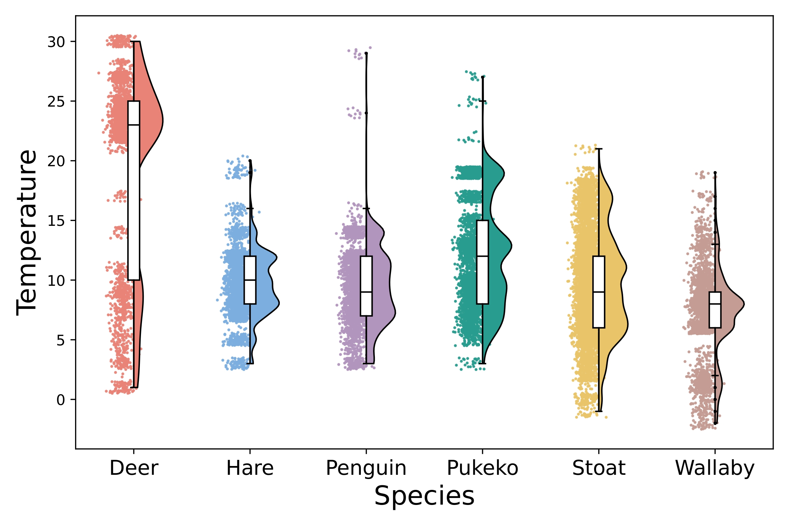

# MetaWild
## Introduction
The MetaWild dataset is a multimodal benchmark designed to improve animal re-identification (Animal ReID) by integrating environmental metadata with visual data. Unlike existing datasets that rely solely on images, MetaWild includes 20,890 images spanning six representative species, each image is paired with metadata such as temperature and circadian rhythms, providing valuable context for distinguishing individual animals. Additionally, to facilitate the use of metadata in existing ReID methods, we propose the Meta-Feature Adapter (MFA), a lightweight module that can be incorporated into existing vision-language model (VLM)-based Animal ReID methods, allowing ReID models to leverage both environmental metadata and visual information to improve ReID performance. Our experiments on MetaWild show that incorporating metadata with MFA consistently improves ReID performance over using visual data alone. We hope that our benchmark can inspire further exploration of multimodal approaches for Animal ReID.

## Data Availability
Our dataset is accessible through:
* [Hugging face](https://huggingface.co/datasets/lucas0927/MetaWild)

## Supplementary Material

<!-- Experiment settings: [Supplementary Material - Experiment](./supplementary-experiment.html) and 
Ablation study: [Supplementary Material - Ablation](./supplementary-ablation.html). -->

This section provides detailed supplementary materials to support the main findings presented in the MAAR project. Our supplementary materials are divided into two key sections:

- **Experiment Settings:** This section provides a comprehensive description of the experimental setup used in our study, including details on the benchmark dataset, baseline models, evaluation metrics, and reproducibility information. For detailed information, please refer to the following link:  
  ➡️ [Supplementary Material - Experiment Settings and Reproducibility](./supplementary-experiment.html)

- **Ablation Study:** This section presents the ablation study that explores the effect of various design choices and metadata features on ReID performance, please refer to the following link:  
  ➡️ [Supplementary Material - Ablation Study](./supplementary-ablation.html)

## Method

## Metadata Distribution Visualizations

### Temperature Distribution

  

### Circadian Rhythms Distribution

  

### Face Orientation Distribution

  

<!-- For inquiries about early access to the dataset for research purposes, please contact [contact information]. -->