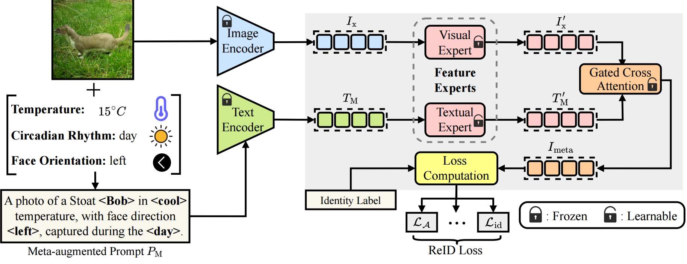

# MAAR: A Multimodal Benchmark for Animal Re-Identification with Environmental Metadata

## Introduction
The Metadata Augmented Animal Re-Identification (MAAR) dataset is a multimodal benchmark designed to improve animal re-identification (Animal ReID) by integrating environmental metadata with visual data. Unlike existing datasets that rely solely on images, MAAR includes 20,890 images spanning six representative species, each image is paired with metadata such as temperature and circadian rhythms, providing valuable context for distinguishing individual animals. Additionally, to facilitate the use of metadata in existing ReID methods, we propose the Meta-Feature Adapter (MFA), a lightweight module that can be incorporated into existing vision-language model (VLM)-based Animal ReID methods, allowing ReID models to leverage both environmental metadata and visual information to improve ReID performance. Our experiments on MAAR show that incorporating metadata with MFA consistently improves ReID performance over using visual data alone. We hope that our benchmark can inspire further exploration of multimodal approaches for Animal ReID.


## Data Availability
Our dataset is accessible through:
* [Hugging face](https://huggingface.co/datasets/uqtwei2/PlantWild)

## Supplementary Material

## Method


## Installation
```python
conda create -n 'your-env-name' python=3.8
conda activate 'your-env-name'
conda install pytorch==1.8.0 torchvision==0.9.0 torchaudio==0.8.0 cudatoolkit=10.2 -c pytorch
pip install yacs
pip install timm
pip install scikit-image
pip install tqdm
pip install ftfy
pip install regex
```

## Training
```python
python train_mfareid.py --config_file configs/animal/vit_mfareid.yml
```
<!-- For inquiries about early access to the dataset for research purposes, please contact [contact information]. -->