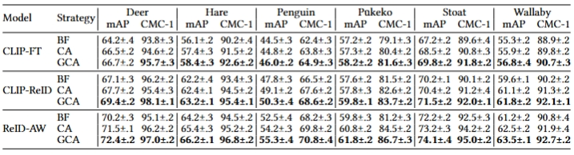
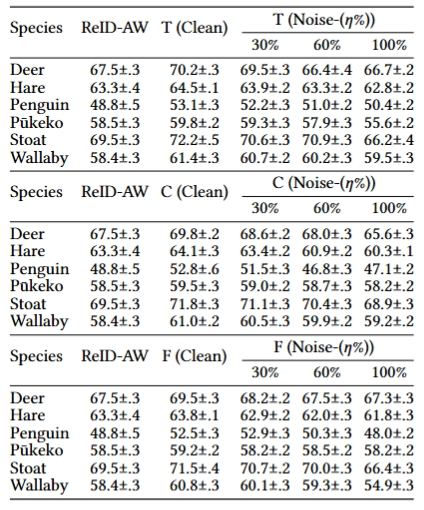

# Supplementary Material: Ablation Study
## Effect of Fusion Strategies
To investigate the effect of different fusion strategies for integrating metadata with visual features in our ReID models, we conducted a comprehensive ablation study. We compared three fusion approaches:

- **Basic Fusion (BF)**: This approach directly concatenates metadata embeddings with visual features, followed by a linear projection layer, providing a simple integration method without any interaction between the two modalities.

- **Cross-Attention (CA)**: This strategy allows feature interaction by computing attention weights between metadata and visual features.

- **Gated Cross-Attention (GCA)**: Our proposed method further improves cross-attention by introducing an adaptive gating mechanism to control the influence of metadata based on visual content.

  

    Table 1. Ablation Study: Impact of Fusion Strategies on mAP and CMC-1 performance across six species.
  

  

<!-- | Model      | Strategy | Deer (mAP) | Deer (CMC-1) | Hare (mAP) | Hare (CMC-1) | Penguin (mAP) | Penguin (CMC-1) | Pūkeko (mAP) | Pūkeko (CMC-1) | Stoat (mAP) | Stoat (CMC-1) | Wallaby (mAP) | Wallaby (CMC-1) |
|-------------|-----------|-------------|---------------|-------------|---------------|----------------|------------------|----------------|----------------|---------------|-----------------|------------------|------------------|
| CLIP-FT     | BF        | 64.2±.4      | 93.8±.3        | 56.1±.2      | 90.2±.4        | 44.5±.3         | 62.4±.3           | 57.2±.2         | 79.1±.3         | 67.2±.2        | 89.6±.4           | 55.3±.2           | 88.9±.2           |
|              | CA        | 66.5±.2      | 94.6±.2        | 57.4±.3      | 91.5±.2        | 44.8±.2         | 63.8±.3           | 57.3±.2         | 80.4±.2         | 68.5±.2        | 90.8±.3           | 55.9±.2           | 89.8±.2           |
|              | GCA       | **66.7±.2**  | **95.7±.3**    | **58.4±.3**  | **92.6±.2**    | **46.0±.2**     | **64.9±.3**       | **58.2±.2**     | **81.6±.3**     | **69.8±.2**    | **91.8±.2**       | **56.8±.4**       | **90.7±.3**       |
| CLIP-ReID   | BF        | 67.1±.3      | 96.2±.2        | 62.2±.4      | 93.4±.3        | 47.8±.3         | 66.5±.2           | 57.6±.2         | 81.5±.2         | 70.2±.1        | 90.1±.2           | 59.6±.1           | 90.2±.2           |
|              | CA        | 67.7±.2      | 95.4±.3        | 62.4±.1      | 94.5±.2        | 49.1±.2         | 67.6±.2           | 57.8±.3         | 82.6±.2         | 70.4±.2        | 91.2±.4           | 61.1±.2           | 91.3±.2           |
|              | GCA       | **69.4±.2**  | **98.1±.1**    | **63.2±.1**  | **95.4±.1**    | **50.3±.4**     | **68.6±.2**       | **59.8±.1**     | **83.7±.2**     | **71.5±.2**    | **92.0±.1**       | **61.8±.2**       | **92.1±.1**       |
| ReID-AW     | BF        | 70.2±.3      | 95.1±.2        | 64.2±.3      | 94.5±.2        | 52.5±.4         | 68.2±.3           | 59.8±.3         | 81.2±.3         | 72.2±.2        | 92.5±.3           | 61.2±.2           | 90.8±.4           |
|              | CA        | 71.5±.1      | 96.2±.2        | 65.4±.3      | 95.2±.2        | 54.2±.3         | 69.8±.2           | 60.8±.2         | 84.5±.2         | 73.2±.3        | 94.2±.2           | 62.5±.2           | 91.9±.4           |
|              | GCA       | **72.4±.2**  | **97.0±.2**    | **66.2±.1**  | **96.8±.2**    | **55.3±.4**     | **70.8±.4**       | **61.8±.2**     | **86.7±.3**     | **74.1±.4**    | **95.0±.2**       | **63.5±.1**       | **92.7±.2**       | -->

The results of this comparison are presented in **Table 1**. Basic Fusion (BF) provides modest improvements across species, such as a 1.5% mAP gain on Deer for the CLIP-FT model. Cross-Attention (CA) strategy outperforms basic fusion by enabling selective feature integration, with particularly notable gains on datasets such as Penguin (0.3% and 1.3% mAP improvements for CLIP-FT and CLIP-ReID respectively). 

Our Gated Cross-Attention (GCA) achieves the best results, consistently outperforming both BF and CA, GCA achieves the best results with improvements of up to 2.8% mAP over basic fusion. This pattern is also observed in the ReID-AW model, where GCA achieves substantial improvements over BF across all species (*e.g.*, 2.2% mAP gain on Deer and 2.8% on Penguin).This performance can be attributed to its ability to adaptively adjust metadata influence based on visual content relevance. For instance, when visual features are highly distinctive, the gate can reduce reliance on metadata while increasing metadata influence for visually ambiguous cases.

* * *

## Effect of Different Metadata Features
To investigate the contribution of each metadata feature and to identify potential interactions between different metadata combinations, we progressively integrated three types of metadata into our models: **Temperature (T)**, **Circadian Rhythm (C)**, and **Face Orientation (F)**. These features were incorporated in three ReID models: **CLIP-FT+MFA**, **CLIP-ReID+MFA**, and **ReID-AW+MFA**.

  

    Table 2. Ablation study on different combinations of metadata features in CLIP-FT+MFA, CLIP-ReID+MFA and ReID-AW+MFA models. Temperature (T), Circadian Rhythm (C), and Face Orientation (F) features are progressively combined to analyze their individual and combined effects on model ReID performance.
  

  

<!-- 
*Table 2(a): CLIP-FT + MFA - mAP (%)*
| T | C | F | Deer | Hare | Penguin | Pūkeko | Stoat | Wallaby |
|---|---|---|------|------|---------|--------|-------|----------|
| ✅ | - | - | 64.8 | 57.4 | 45.4    | 57.1   | 68.5  | 55.7     |
| - | ✅ | - | 64.5 | 57.1 | 44.3    | 56.8   | 68.2  | 55.7     |
| - | - | ✅ | 64.2 | 56.8 | 44.9    | 56.5   | 67.9  | 55.4     |
| ✅ | ✅ | - | 66.1 | 58.0 | 45.7    | 57.7   | 69.2  | 56.5     |
| ✅ | - | ✅ | 65.7 | 57.8 | 45.1    | 58.0   | 68.9  | 56.3     |
| - | ✅ | ✅ | 65.3 | 57.6 | 44.6    | 57.4   | 69.5  | 56.0     |
| ✅ | ✅ | ✅ | **66.7** | **58.4** | **46.0** | **58.2** | **69.8** | **56.8** |

*Table 2(b): CLIP-ReID + MFA - mAP (%)* 
| T | C | F | Deer | Hare | Penguin | Pūkeko | Stoat | Wallaby |
|---|---|---|------|------|---------|--------|-------|----------|
| ✅ | - | - | 67.4 | 61.8 | 47.4    | 58.5   | 70.1  | 59.2     |
| - | ✅ | - | 67.1 | 61.5 | 46.8    | 58.2   | 69.2  | 58.4     |
| - | - | ✅ | 66.8 | 61.2 | 47.1    | 57.9   | 69.8  | 58.9     |
| ✅ | ✅ | - | 68.8 | 62.7 | 48.5    | 59.5   | 70.9  | 60.8     |
| ✅ | - | ✅ | 68.5 | 62.4 | 49.4    | 59.2   | 71.1  | 60.5     |
| - | ✅ | ✅ | 68.2 | 62.1 | 49.1    | 58.9   | 70.6  | 60.1     |
| ✅ | ✅ | ✅ | **69.4** | **63.2** | **50.3** | **59.8** | **71.5** | **61.8** |

*Table 2(c): ReID-AW + MFA - mAP (%)*
| T | C | F | Deer | Hare | Penguin | Pūkeko | Stoat | Wallaby |
|---|---|---|------|------|---------|--------|-------|----------|
| ✅ | - | - | 70.2 | 64.5 | 53.1    | 59.8   | 72.2  | 61.4     |
| - | ✅ | - | 69.8 | 64.1 | 52.8    | 59.5   | 71.8  | 61.0     |
| - | - | ✅ | 69.5 | 63.8 | 52.5    | 59.2   | 71.5  | 60.8     |
| ✅ | ✅ | - | 71.5 | 65.1 | 54.5    | 60.2   | 73.2  | 62.5     |
| ✅ | - | ✅ | 71.2 | 65.4 | 54.2    | 60.3   | 73.5  | 62.2     |
| - | ✅ | ✅ | 70.8 | 64.8 | 53.5    | 59.3   | 73.0  | 61.8     |
| ✅ | ✅ | ✅ | **72.4** | **66.2** | **55.3** | **61.8** | **74.1** | **63.5** | -->

The results of this ablation study are summarized in **Table 2**, which reveals the impact of each metadata type on model performance, as measured by mean Average Precision (mAP). The results show that temperature contributes most to ReID performance across all models, achieving the highest mAP. This aligns with zoological research showing that temperature significantly influences animal behavior and appearance[^1]. As the temperature fluctuates, animals may exhibit variations in posture, movement patterns, and even fur characteristics, providing additional discriminative features for ReID. Moreover, different individuals often show distinct temperature preferences and behavioral adaptations[^2], making temperature-related features valuable for ReID tasks. When combining all three metadata types (T+C+F), we observe the best performance across all datasets, suggesting that each metadata type contributes complementary information. 

* * * 

## Effect of Noisy Metadata
To evaluate the robustness of metadata and determine whether its benefits persist under noisy conditions, we introduced artificial noise into three metadata types: **Temperature (T)**, **Circadian Rhythm (C)**, and **Face Orientation (F)**. The noise levels were set at **30%**, **60%**, and **100%**, representing progressively higher levels of noise, the results are presented in **Table 3**.

<!-- *Table 3(a): Temperature (T) - mAP (%)*
| Species | ReID-AW | T (Clean) | T (Noise-30%) | T (Noise-60%) | T (Noise-100%) |
|----------|---------|------------|----------------|----------------|-----------------|
| Deer     | 67.5±.3 | **70.2±.3** | 69.5±.3         | 68.4±.4         | 67.7±.2          |
| Hare     | 63.3±.4 | **64.5±.1** | 63.9±.2         | 63.3±.2         | 62.8±.2          |
| Penguin  | 48.8±.5 | **53.1±.3** | 52.2±.3         | 51.0±.2         | 50.4±.2          |
| Pūkeko   | 58.5±.3 | **59.8±.2** | 59.3±.3         | 58.9±.3         | 58.6±.2          |
| Stoat    | 69.5±.3 | **72.2±.5** | 71.6±.3         | 70.9±.3         | 70.2±.4          |
| Wallaby  | 58.4±.3 | **61.4±.3** | 60.7±.2         | 60.2±.3         | 59.5±.3          |

*Table 3(b): Circadian Rhythm (C) - mAP (%)*
| Species | ReID-AW | C (Clean) | C (Noise-30%) | C (Noise-60%) | C (Noise-100%) |
|----------|---------|------------|----------------|----------------|-----------------|
| Deer     | 67.5±.3 | **69.8±.2** | 68.6±.2         | 68.0±.3         | 67.6±.3          |
| Hare     | 63.3±.4 | **64.1±.3** | 63.4±.2         | 62.9±.2         | 62.3±.1          |
| Penguin  | 48.8±.5 | **52.8±.6** | 51.5±.3         | 49.8±.3         | 49.1±.2          |
| Pūkeko   | 58.5±.3 | **59.5±.3** | 59.0±.2         | 58.7±.3         | 58.2±.2          |
| Stoat    | 69.5±.3 | **71.8±.3** | 71.1±.3         | 70.4±.3         | 69.9±.3          |
| Wallaby  | 58.4±.3 | **61.0±.2** | 60.5±.3         | 59.9±.2         | 59.2±.2          |

*Table 3(c): Face Orientation (F) - mAP (%)*
| Species | ReID-AW | F (Clean) | F (Noise-30%) | F (Noise-60%) | F (Noise-100%) |
|----------|---------|------------|----------------|----------------|-----------------|
| Deer     | 67.5±.3 | **69.5±.3** | 68.2±.2         | 67.5±.3         | 67.3±.3          |
| Hare     | 63.3±.4 | **63.8±.1** | 62.9±.2         | 62.0±.3         | 61.8±.3          |
| Penguin  | 48.8±.5 | **52.5±.3** | 52.9±.3         | 50.3±.3         | 49.0±.2          |
| Pūkeko   | 58.5±.3 | **59.2±.2** | 58.2±.2         | 58.5±.2         | 58.2±.2          |
| Stoat    | 69.5±.3 | **71.5±.4** | 70.7±.2         | 70.0±.3         | 69.4±.3          |
| Wallaby  | 58.4±.3 | **60.8±.3** | 60.1±.3         | 59.3±.3         | 58.9±.3          | -->

  

    Table 3. ReID-AW+MFA performance with Temperature Conditions (T), Circadian Rhythms (C), and Face Orientation (F) at different noise levels.
  

  

For **Temperature**, at a moderate noise level of 30%, the performance drop from clean to noisy metadata is generally small. For instance, Deer drops slightly from 70.2±.3 to 69.5±.3, and Stoat from 72.2±.5 to 70.6±.3. This robustness can be attributed to the discretisation process applied to temperature metadata, where numerical values are mapped into categorical bins (e.g., cold,'' warm''). Minor perturbations due to noise may not result in a change of category, reducing the impact of noise. However, at 60% and 100% noise, the performance consistently declines across all species. For example, Pūkeko drops from 59.8±.2 to 55.6±.2 (100% noise), returning to or below the ReID-AW baseline.

For **Circadian Rhythm**, which categorises images as ``day`` or ``night``, performance gradually declines as noise increases. For example, Hare decreases from 64.1±.3 to 60.3±.1, and Penguin from 52.8±.6 to 47.1±.2 as noise reaches 100%. Although performance at 30% noise remains relatively stable (*e.g.*, Stoat at 71.8±.3 to 71.1±.3), the benefit diminishes rapidly beyond that. This shows that while the binary nature of circadian labels offers some robustness, incorrect labels quickly introduce confusion and diminish the advantage.

For most species (*e.g.*, Deer, Stoat, Wallaby), performance under 30% **face orientation** noise remains above the ReID-AW baseline. However, as noise increases, the benefit narrows. At 100% noise, results converge close to the baseline for Deer (67.3±.3) and drop below for Wallaby (54.9±.3). Notably, for Pūkeko and Penguin, orientation metadata becomes harmful even at moderate noise levels. For example, Penguin drops from 52.5±.3 (clean) to 48.0±.2 at 100% noise, which is lower than the baseline (48.8±.5). A possible explanation is that Pūkeko’s head is proportionally small compared to its body, making it difficult to determine precise orientation. Additionally, Penguins, when facing forward, exhibit minimal visual distinction between slight left-right head tilts, which could lead to unreliable orientation labels.

These results highlight that metadata can substantially improve ReID performance when reliable. Metadata types such as temperature and circadian rhythm, which are discretised and broadly applicable, show higher resilience to moderate noise. Face orientation is beneficial for species where pose strongly correlates with identity, but can degrade performance when annotation is noisy or the visual signal is weak. Overall, the findings emphasize that not all metadata types are equally informative across species, and that careful selection and robust annotation of metadata are essential for maximizing its utility in ReID tasks.

<!-- The overall results show that metadata can improve re-identification performance when reliable. Face Orientation benefits certain species (Deer, Stoat, Wallaby) but is ineffective for Pūkeko and Penguin, suggesting that not all metadata features are equally applicable across species. For practical applications, these findings emphasise the importance of careful metadata selection. When metadata is well-structured and correlates with identity-distinguishing traits, it provides a meaningful boost to re-identification performance. However, metadata that is difficult to annotate consistently or lacks sufficient intra-class variation may fail to contribute or even degrade performance under noise. These insights highlight the necessity of robust annotation protocols and species-specific considerations when integrating environmental metadata into ReID models. -->

[^1]: Shermeister, B., Mor, D., & Levy, O. (2024). Leveraging camera traps and artificial intelligence to explore thermoregulation behaviour. Journal of Animal Ecology, 93(9), 1246-1261.
[^2]: Lagerspetz, K. Y., & Vainio, L. A. (2006). Thermal behaviour of crustaceans. Biological Reviews, 81(2), 237-258.